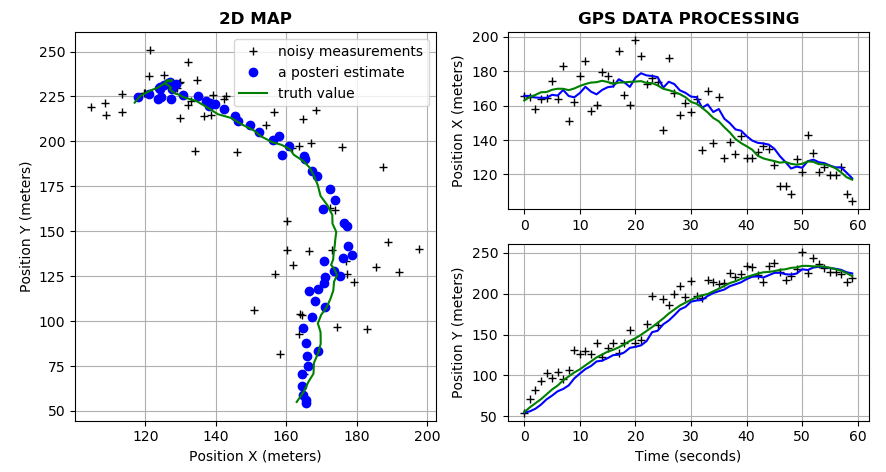
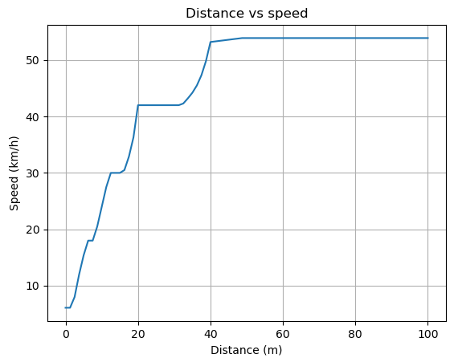

# sdc-console-python

Read this in other languages: [English](README.md), [Russian/Русский](README.ru.md). 

`sdc-console-python` allows you to use **Kalman Filter** to process data from *GPS*, *speedometer* and *accelerometer* in order to estimate vehicle position. 

In addition, this app includes **fuzzy controller** module that allows you to calculate *desired speed* of a car. 

[Click here](docs/design.md) to read about the application's design. 

## How to use  

### Prerequisites

- Windows OS;
- Python 3.8; 
- Any text editor (VS Code, Sublime Text, Notepad++); 
- Command prompt.

### How to download  

You can download this repository, typing the following command: 
```
git clone https://github.com/alexeysp11/sdc-console-python
```

### Code snippets

The entry point is in the `main.py` file.
First, you need to import `Console` and `Invoke` classes. 

`Console` class allows you to use console in the application (for example, type a command or get info about the app), and `Invoke` class allows you to invoke modules of this app, such as *GPS*, *IMU* or *fuzzy controller*. 

Then the message *'Welcome to SDC console!'* is printed out on the screen, and `get_command()` method of the `Console` class is invoked in order to get a command entered by the user. 
Next, some method of the `Invoke` class is called corresponding to the command entered by the user.
```python
from console.console import Console as console
from application.invoke import Invoke as invoke

if __name__ == '__main__': 
    print()
    print('Welcome to SDC console!')

    while(1):
        module, mode = console.get_command()
        
        if module == 'gps': 
            invoke.gps(mode=mode)
        elif module == 'imu': 
            invoke.imu(mode=mode)
        elif module == 'fuzzy': 
            invoke.fuzzy()
```

You can set default *position*, *velocity* and *acceleration* of a car in the method `initialize()` of the `Car` class:
```python
class Car: 
    def initialize(self, dimension=1, init_velocity=0.0, mode='p', 
        is_accel=False, is_default=True):

        ...

        if dimension == 1: 
            # if we use default values
            if is_default == True:
                init_pos = 45.0
                init_guess = 55.0
                velocity = init_velocity
                time_sec = 50

                print(f'Truth value: {init_pos}')
                print(f'Initial guess: {init_guess}')
                print(f'Velocity (m/s): {velocity}')
                print(f'Time (sec): {time_sec}')
            
            # if we enter our own values
            else:
                ... 
            
            truth_value = self.count_position(init_pos, velocity, is_accel, time_sec)
            
        if dimension == 2: 
            # if we use default values
            if is_default == True:
                init_pos = (163.0, 55.0)
                init_guess = (152.0, 68.0)
                velocity = init_velocity
                time_sec = 60

                print(f'Real coordinates (at the beginning): {init_pos}')
                print(f'Initial coordinates: {init_guess}')
                print(f'Velocity_x: {velocity[0]} m/s')
                print(f'Velocity_y: {velocity[1]} m/s')
                print(f'Time (sec): {time_sec}')
            
            # if we enter our own values
            else:
                ...
            
            truth_value = self.count_position(init_pos, velocity, is_accel, time_sec)
        
        return (truth_value, init_guess, time_sec)
```

To process data from a GPS receiver, the `gps_kf()` method of the `SignalProcessingAlgorithm` class is used.

In the `gps_kf()` method, the error of GPS `abs_error` is set, the measured data of the GPS receiver is generated by calling the `measure()` method of the `Sensor` class, and then the `KalmanFilter` is called.
After that, you can get info about algorithm accuracy and some visual representation of processed data. 
Similarly, the combination of the GPS receiver, speedometer and accelerometer is performed in the `imu_kf()` method:
```python 
import sys, traceback
import numpy as np
from tabulate import tabulate
import matplotlib.pyplot as plt

sys.path.append('../sensors')
sys.path.append('../math')

from sensors.sensor import Sensor 
from maths.kalman_filter import KalmanFilter 


class SignalProcessingAlgorithm: 
    def gps_kf(self, dimension=1, init_data=0):
        """
        Invokes Kalman filter for 1D and 2D and plots graphs.  
        """
        
        abs_error = 10.0
        
        try:
            sensor = Sensor()
            kf = KalmanFilter(error=abs_error)
            
            # generate GPS observations. 
            obs, time = sensor.measure(init_data, abs_error=abs_error, unit='position')
            
            # estimate position using Kalman filter  
            est = kf.estimate(obs)
            
            # print out results and plot all. 
            self.mean, self.median, est_error = self.print_out(obs, est, 
                init_data)
            
            self.plot(obs=obs, est=est, est_error=est_error, time=time,  
                init_data=init_data, dim=dimension, sensor='gps')
        
        except Exception as e:
            print('Exception: '.upper(), e)
            traceback.print_tb(e.__traceback__)


    def imu_kf(self, dimension=1, init_data=0):
        """
        Invokes Kalman filter for 1D and 2D and plots graphs.  
        """

        dt_gps = 1.0
        dt_speed = 1.0
        dt_accel = 1.0
        gps_error = 50.0
        
        try:
            sensor = Sensor()
            kf = KalmanFilter(error=gps_error)
            
            # generate GPS observations. 
            gps_obs, time = sensor.measure(init_data, abs_error=gps_error, unit='position', dt=dt_gps)
            
            # estimate position using GPS data
            est_gps = kf.estimate(observations=gps_obs)
            
            # generate speedometer and accelerometer observations. 
            speed_obs, time = sensor.measure(init_data, abs_error=0.1, unit='velocity', dt=dt_speed)
            accel_obs, time = sensor.measure(init_data, abs_error=0.01, unit='acceleration', dt=dt_accel)

            # correct postion observations
            gps_rows = len(est_gps[:,0])
            speed_rows = len(speed_obs[:,0])
            accel_rows = len(accel_obs[:,0])
            corrected_position = np.ones((accel_obs.shape))
            k = 0
            for i in range(gps_rows): 
                for j in range(int(accel_rows/gps_rows)): 
                    corrected_position[k] = est_gps[i]
                    k += 1
            k = 0
            for i in range(speed_rows): 
                for j in range(int(accel_rows/speed_rows)): 
                    corrected_position[k] += speed_obs[i] * dt_speed
                    k += 1
            for i in range(accel_rows): 
                corrected_position[i] += accel_obs[i] * dt_accel**2 / 2
            
            # estimate corrected position data
            est = kf.estimate(observations=corrected_position)
            
            # print out results. 
            self.mean, self.median, est_error = self.print_out(corrected_position, est, init_data, dt_accel)
            
            # plot results
            self.plot(obs=corrected_position, est=est, est_error=est_error, 
                time=time, init_data=init_data, dim=dimension, sensor='multisensor')
        except Exception as e:
            print('Exception: '.upper(), e)
            traceback.print_tb(e.__traceback__)
    ...
```

## Results

The result of the **Kalman filter** for processing the data of the GPS receiver is shown in the figure below:



The result of the **one variable fuzzy controller** is shown below:



The result of the **three variables fuzzy controller** is shown below:


