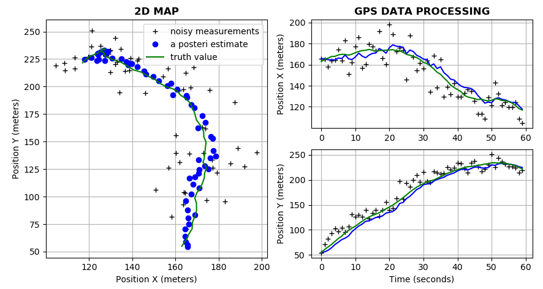
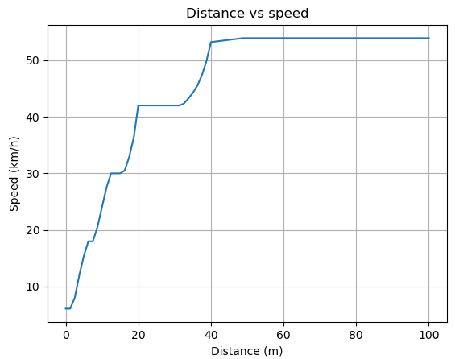
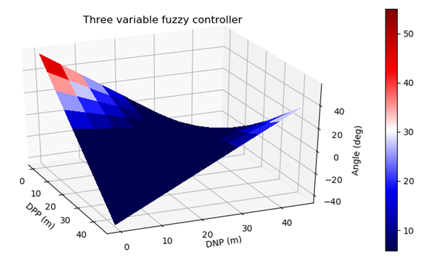

# sdc-console-python

[English](README.md) | [Русский](README.ru.md)

Проект `sdc-console-python` представляет собой приложение на основе Python, которое использует фильтр Калмана для обработки данных датчиков GPS, спидометра и акселерометра для оценки положения транспортного средства.
Приложение также включает в себя модуль нечеткого контроллера, который рассчитывает желаемую скорость автомобиля.

## Описание

`sdc-console-python` позволяет использовать **фильтр Калмана** для обработки данных с *GPS-приёмника*, *спидометра* и *акселерометра* для оценки позиции автомобиля. 

Помимо этого, данное приложение влючает в себя модуль **нечёткого регулятора**, который позволяет рассчитать *желательную скорость движения автомобиля*. 

[Кликните здесь](docs/design.md) для того, чтобы прочитать информацию по архитектуре приложения. 

### Цели

Основная цель проекта — предоставить эффективный и точный способ оценки положения автомобиля с помощью различных датчиков. Кроме того, модуль нечеткого контроллера помогает определить желаемую скорость автомобиля, что может быть полезно в различных приложениях.

### Сфера применения

Сфера применения проекта сосредоточена на обработке данных датчиков GPS, спидометра и акселерометра и использовании фильтра Калмана для оценки положения транспортного средства.
Модуль нечеткого контроллера — это дополнительная функция, расширяющая функциональность приложения.

## Как использовать 

### Требования

- Windows OS;
- Python 3.8; 
- Любой текстовый редактор (VS Code, Sublime Text, Notepad++); 
- Командная строка.

### Как скачать репозиторий 

Скачать репозиторий можно с помощью следующей команды: 

```
git clone https://github.com/alexeysp11/sdc-console-python
```

### Примеры кода

Точка входа находится в файле `main.py`. 
Здесь сначала подключаются класс `Console` для работы с консолью и класс `Invoke` для вызова модулей, которые используются в приложении (например, *GPS*, *IMU* или *нечёткий регулятор*). 

Далее производится приветствие и вызов метода `get_command()` класса `Console` для определения команды, которую ввёл пользователь. 
Затем вызывается метод класса `Invoke`, соответствующий той команде, которую ввёл пользователь. 
```python
from console.console import Console as console
from application.invoke import Invoke as invoke

if __name__ == '__main__': 
    print()
    print('Welcome to SDC console!')

    while(1):
        module, mode = console.get_command()
        
        if module == 'gps': 
            invoke.gps(mode=mode)
        elif module == 'imu': 
            invoke.imu(mode=mode)
        elif module == 'fuzzy': 
            invoke.fuzzy()
```

Настроить значения *позиции*, *скорости* и *ускорения* автомобиля по умолчанию можно в методе `initialize()` класса `Car`:
```python
class Car: 
    def initialize(self, dimension=1, init_velocity=0.0, mode='p', 
        is_accel=False, is_default=True):

        ...

        if dimension == 1: 
            # if we use default values
            if is_default == True:
                init_pos = 45.0
                init_guess = 55.0
                velocity = init_velocity
                time_sec = 50

                print(f'Truth value: {init_pos}')
                print(f'Initial guess: {init_guess}')
                print(f'Velocity (m/s): {velocity}')
                print(f'Time (sec): {time_sec}')
            
            # if we enter our own values
            else:
                ... 
            
            truth_value = self.count_position(init_pos, velocity, is_accel, time_sec)
            
        if dimension == 2: 
            # if we use default values
            if is_default == True:
                init_pos = (163.0, 55.0)
                init_guess = (152.0, 68.0)
                velocity = init_velocity
                time_sec = 60

                print(f'Real coordinates (at the beginning): {init_pos}')
                print(f'Initial coordinates: {init_guess}')
                print(f'Velocity_x: {velocity[0]} m/s')
                print(f'Velocity_y: {velocity[1]} m/s')
                print(f'Time (sec): {time_sec}')
            
            # if we enter our own values
            else:
                ...
            
            truth_value = self.count_position(init_pos, velocity, is_accel, time_sec)
        
        return (truth_value, init_guess, time_sec)
```

Для обработки данных GPS-приёмника используется метод `gps_kf()` класса `SignalProcessingAlgorithm`.

В методе `gps_kf()` задаётся погрешность GPS-приёмника `abs_error`, генерируются измеренные данные GPS-приёмника путём вызова метода `measure()` класса `Sensor`, и вызывается фильтр Калмана. 
После этого результаты работы алгоритма выводятся на экран в виде текстовой информации и в виде графиков. 
Аналогичным образом производится совмещение GPS-приёмника, спидометра и акселерометра в методе `imu_kf()`: 
```python 
import sys, traceback
import numpy as np
from tabulate import tabulate
import matplotlib.pyplot as plt

sys.path.append('../sensors')
sys.path.append('../math')

from sensors.sensor import Sensor 
from maths.kalman_filter import KalmanFilter 


class SignalProcessingAlgorithm: 
    def gps_kf(self, dimension=1, init_data=0):
        """
        Invokes Kalman filter for 1D and 2D and plots graphs.  
        """
        
        abs_error = 10.0
        
        try:
            sensor = Sensor()
            kf = KalmanFilter(error=abs_error)
            
            # generate GPS observations. 
            obs, time = sensor.measure(init_data, abs_error=abs_error, unit='position')
            
            # estimate position using Kalman filter  
            est = kf.estimate(obs)
            
            # print out results and plot all. 
            self.mean, self.median, est_error = self.print_out(obs, est, 
                init_data)
            
            self.plot(obs=obs, est=est, est_error=est_error, time=time,  
                init_data=init_data, dim=dimension, sensor='gps')
        
        except Exception as e:
            print('Exception: '.upper(), e)
            traceback.print_tb(e.__traceback__)


    def imu_kf(self, dimension=1, init_data=0):
        """
        Invokes Kalman filter for 1D and 2D and plots graphs.  
        """

        dt_gps = 1.0
        dt_speed = 1.0
        dt_accel = 1.0
        gps_error = 50.0
        
        try:
            sensor = Sensor()
            kf = KalmanFilter(error=gps_error)
            
            # generate GPS observations. 
            gps_obs, time = sensor.measure(init_data, abs_error=gps_error, unit='position', dt=dt_gps)
            
            # estimate position using GPS data
            est_gps = kf.estimate(observations=gps_obs)
            
            # generate speedometer and accelerometer observations. 
            speed_obs, time = sensor.measure(init_data, abs_error=0.1, unit='velocity', dt=dt_speed)
            accel_obs, time = sensor.measure(init_data, abs_error=0.01, unit='acceleration', dt=dt_accel)

            # correct postion observations
            gps_rows = len(est_gps[:,0])
            speed_rows = len(speed_obs[:,0])
            accel_rows = len(accel_obs[:,0])
            corrected_position = np.ones((accel_obs.shape))
            k = 0
            for i in range(gps_rows): 
                for j in range(int(accel_rows/gps_rows)): 
                    corrected_position[k] = est_gps[i]
                    k += 1
            k = 0
            for i in range(speed_rows): 
                for j in range(int(accel_rows/speed_rows)): 
                    corrected_position[k] += speed_obs[i] * dt_speed
                    k += 1
            for i in range(accel_rows): 
                corrected_position[i] += accel_obs[i] * dt_accel**2 / 2
            
            # estimate corrected position data
            est = kf.estimate(observations=corrected_position)
            
            # print out results. 
            self.mean, self.median, est_error = self.print_out(corrected_position, est, init_data, dt_accel)
            
            # plot results
            self.plot(obs=corrected_position, est=est, est_error=est_error, 
                time=time, init_data=init_data, dim=dimension, sensor='multisensor')
        except Exception as e:
            print('Exception: '.upper(), e)
            traceback.print_tb(e.__traceback__)
    ...
```

## Результаты работы приложения

Результат работы **фильтра Калмана** для обработки данных GPS-приёмника представлен на рисунке ниже: 



Результат работы **нечёткого регулятора для одной переменной** представлен ниже. 



Результат работы **нечёткого регулятора для трёх переменных** представлен ниже. 


